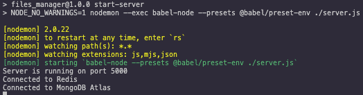

  <h1 align="center">
  
   Files Manager: A Simple Data Management Platform
  </h1>

## Intro
This File Manager software is a simple platform designed to upload and view files. It utilizes the following for a safe interactions and manipulations:
-  User Authentication
-  CRUD Actions
-  Permissions

The program uses MongoDB to store data and access documents through an Express Server with curl requests. The program also uses Redis for authentication and token generation to safely store and access data.

---

## Usage
This program uses Npm as a package manager. The node_modules have been explicity left out of this version. To use the file manager software, you must run `npm i` in the root of the repository to initialize all services and dependencies. 

This software is still in development and lacks a front-end user experience, but can be use on a command-line using `curl` to access the server.

### Set Up

This program will connect to a designated cluster on MongoDB. You will need to set up a Database with the name `files_manager`, and the collections `users` and `files`.

<table><tr><td align=center><h4>PLEASE NOTE</h4>
This server runs with dotenv for a custom connection and secure database set up. A <span style="font-weight: bold">.env</span> file is necessary for this program to function.

Your .env file should be in the root of the repository, and contain the following values:
```
DB_HOST=
DB_PORT=
DB_DATABASE=files_manager
DB_USERNAME= 
DB_PASSWORD=
```

Please create your own .env to set up your environment and successfully connect to a cluster. It would be more than beneficial to integrate MongoAtlas and MongoCompass for your ease of use.
</td></tr></table>

### Initialize the Server

After running `npm i` in the root of the repository, run `npm run start-server` to start the Express server and entry point. The server will log the port is is listening too, as well as it's connection status. 

<h4 align="center"> </span>

## Operations - In a Separate Terminal
Please complete any curl request in a separate terminal

### Confirm Connection to Redis and Mongo
Use the following endpoints to ensure connection to Redis and Mongo services:

```
$ curl 0.0.0.0:5000/status ; echo ""
{"redis":true,"db":true}
$ 
$ curl 0.0.0.0:5000/stats ; echo ""
{"users":4,"files":30}
$ 

```

### Creating a new User
To create a user, you must specify an email and password, and the email must not already be registered in the system.:
```
$ curl 0.0.0.0:5000/users -XPOST -H "Content-Type: application/json" -d '{ "email": "me@email.com", "password": "p@ssw0rd" }' ; echo ""
{"id":"5f1e7d35c7ba06511e683b21","email":"me@email.com"}
```
The server will return your unique `userId`, this will be used later. 


Any attempt to create a user without an email or password, or if the email is already registered will result in an error:
```
$ ...
$ curl 0.0.0.0:5000/users -XPOST -H "Content-Type: application/json" -d '{ "email": "me@email.com", "password": "p@ssw0rd" }' ; echo ""
{"error":"Already exist"}
$
$ curl 0.0.0.0:5000/users -XPOST -H "Content-Type: application/json" -d '{ "email": "you@email.com" }' ; echo ""
{"error":"Missing password"}
```

### User Authentication (Sign-in/Sign-out)
Your user will be created, but in order to access the database, your identity must be authenticated. To do so, sign in using the connect feature.
In order to connect, you will need to encode your `email` and `password` into `Base64`. You can use online tools to do so, like [Base64 Encode](https://www.base64encode.org/). Your encoded string will be in the following format: `email:password`. 

Here is how to connect and authenticate your user session:
```
$ curl 0.0.0.0:5000/connect -H "Authorization: Basic <BASE64>" ; echo ""
{"token":"031bffac-3edc-4e51-aaae-1c121317da8a"}
```

This token will be available for 24 hours. It would be a good idea to save this token somewhere in your system for your session.


To verify you are signed in, use the /users/me while signed in and retrieve your `userId` and `email`:
```
$ curl 0.0.0.0:5000/users/me -H "X-Token: 031bffac-3edc-4e51-aaae-1c121317da8a" ; echo ""
{"id":"5f1e7cda04a394508232559d","email":"me@email.com"}
```

You can also sign-out using the /disconnect route and the authentication `token` generated for you:
```
$curl 0.0.0.0:5000/disconnect -H "X-Token: 031bffac-3edc-4e51-aaae-1c121317da8a" ; echo ""

```

And you can verify you're signed out by attempting to access /users/me again:
```
$ curl 0.0.0.0:5000/users/me -H "X-Token: 031bffac-3edc-4e51-aaae-1c121317da8a" ; echo ""
{"error":"Unauthorized"}
```

### Creating A File
Once signed in, you can create a file that will be attached to your `userId`. Use the POST /files method to do so. 

To create a file, you must specify:
 -  name: as the file name
 -  type: folder, file, or image
 -  parentId (optional): default is 0, or the root, used for storing files in folders
 -  isPublic (optional): default is false
 -  data (only for images): as Base64 of the file content -> **Not Yet Implemented In Program**

The file will also be saved to your local disk, and can be found in your /tmp/files_manager folder (created upon first file creation)

The serve will return to you the file `_id`, your `userId`, the name of the file, the type (folder, file, or image), the public status, and the parentId.

```
$ curl -XPOST 0.0.0.0:5000/files -H "X-Token: f21fb953-16f9-46ed-8d9c-84c6450ec80f" -H "Content-Type: application/json" -d '{ "name": "myText.txt", "type": "file", "data": "SGVsbG8gV2Vic3RhY2shCg==" }' ; echo ""
{"id":"5f1e879ec7ba06511e683b22","userId":"5f1e7cda04a394508232559d","name":"myText.txt","type":"file","isPublic":false,"parentId":0}
```

### Listing All Files or Individual Files for a User
Once signed in, you can access all of your files and any other files that are public. 
Use the Get /files/:id for a specific file:
```
$ curl -XGET 0.0.0.0:5000/files/5f1e8896c7ba06511e683b25 -H "X-Token: f21fb953-16f9-46ed-8d9c-84c6450ec80f" ; echo ""
{"id":"5f1e8896c7ba06511e683b25","userId":"5f1e7cda04a394508232559d","name":"image.png","type":"image","isPublic":true,"parentId":"5f1e881cc7ba06511e683b23"}
```

Or, use /files with a parentId parameter to access files within a specific directory. Since parentId is set as 0 (root), it will show all files in the root unless specified. 
```
$ curl -XGET 0.0.0.0:5000/files -H "X-Token: f21fb953-16f9-46ed-8d9c-84c6450ec80f" ; echo ""
[{"id":"5f1e879ec7ba06511e683b22","userId":"5f1e7cda04a394508232559d","name":"myText.txt","type":"file","isPublic":false,"parentId":0},{"id":"5f1e881cc7ba06511e683b23","userId":"5f1e7cda04a394508232559d","name":"images","type":"folder","isPublic":false,"parentId":0},{"id":"5f1e8896c7ba06511e683b25","userId":"5f1e7cda04a394508232559d","name":"image.png","type":"image","isPublic":true,"parentId":"5f1e881cc7ba06511e683b23"}]
```
Using the specific parentId:
```
$ curl -XGET 0.0.0.0:5000/files?parentId=5f1e881cc7ba06511e683b23 -H "X-Token: f21fb953-16f9-46ed-8d9c-84c6450ec80f" ; echo ""
[{"id":"5f1e8896c7ba06511e683b25","userId":"5f1e7cda04a394508232559d","name":"image.png","type":"image","isPublic":true, "parentId":"5f1e881cc7ba06511e683b23"}]
```
### Publishing Files for Public View
You can update the Public Status of a specific file using the /publish and /unpublish route. You will have to specify the file.
```
$ curl -XPUT 0.0.0.0:5000/files/5f1e8896c7ba06511e683b25/publish -H "X-Token: f21fb953-16f9-46ed-8d9c-84c6450ec80f" ; echo ""
{"id":"5f1e8896c7ba06511e683b25","userId":"5f1e7cda04a394508232559d","name":"image.png","type":"image","isPublic":true,"parentId":"5f1e881cc7ba06511e683b23"}
$ 
$ curl -XPUT 0.0.0.0:5000/files/5f1e8896c7ba06511e683b25/unpublish -H "X-Token: f21fb953-16f9-46ed-8d9c-84c6450ec80f" ; echo ""
{"id":"5f1e8896c7ba06511e683b25","userId":"5f1e7cda04a394508232559d","name":"image.png","type":"image","isPublic":false,"parentId":"5f1e881cc7ba06511e683b23"}
$ 
```
### Accessing File Data

---

### Repository Structure
```
[Package/Env Configs]
server.js
worker.js
utils/
    redis.js
    db.js
routes/
    index.js
controllers/
    AppController.js
    UsersController.js
    AuthController.js
    FilesController.js
tests/
    redis.test.js
    db.test.js
    index.test.js
```
### File/Component Explanation and Expansion

#### Package and Environment Config Files

`package.json`
- Configures dependencies and services to be used by Npm

`package-lock.json`
- Records exact versions of depency ranges for Npm

`babel.config.js`
- Babel configuration file for JavaScript code conversion for compatibility

`.eslintrc.js`
- ESLint configuration file for linting purposes

&nbsp;

#### Entry Point: `server.js`
- Uses Express to establish a live server connection. Serves as entry point and gathers information, environment variables, and curling data. Uses as the main server and interaction point for users.

&nbsp;

### Repository Structure
```
[Package/Env Configs]
utils/
    redis.js
    db.js
routes/
    index.js
controllers/
    AppController.js
    UsersController.js
    AuthController.js
    FilesController.js
tests/
    redis.test.js
    db.test.js
    index.test.js
```

&nbsp;

#### utils/

`redis.js`
- Creates a client for a Redis Connection. Serves as storage for User Authentication services by `express.js`. The `RedisClient` class features methods to determine the connection status to Redis, as well as Redis value CRUD operations. 

`db.js`
- Creates a client to *MongoDB* and secures a connection. Serves as data storage and interaction for File Management operations by `express.js`. The `DBClient` class features methods to determine the connection status to MongoDB, as well as the database's collection tracking operations.

&nbsp;

#### controllers/

`AppController.js`
- Gives functionality to the endpoints:
```
GET /status
GET /stats
```
- Checks to see if the connection to Redis and DB is alive, as well as returning the number of users and files in their respective collections in the DB.


`UsersController.js`
- Gives functionality to the endpoints:
```
POST /users
GET /users/me
```
- Creates a new user in the DB with a specified email and password (SHA1 hashed), and displays a welcome message upon connection.


`AuthController.js`
- Gives functionality to the endpoints:
```
GET /connect
GET /disconnect
```
- Allows user to sign-in and sign-out using the `Authorization` header. Uses the `RedisClient` class to generate and store a authentication key for 24 hours.


`FilesController.js`
- Gives functionality to the endpoints:
```
POST /files
GET /files
GET /files/:id
GET /files/:id/data
PUT /files/:id/publish
PUT /files/:id/unpublish
```
- Creates a new file in the DB and in disk with specified attributes, retrieves files based on document and user access, and allows for updating file data and/or updating the public access of a specified file. Also features a thumbnail generator method that is serviced by `worker.js`.

&nbsp;

#### tests/
The following components are tested inside of this directory:
```
RedisClient
DBClient
The Following Endpoints:
    GET /status
    GET /stats
    POST /users
    GET /connect
    GET /disconnect
    GET /users/me
    POST /files
    GET /files/:id
    GET /files
    PUT /files/:id/publish
    PUT /files/:id/unpublish
    GET /files/:id/data
```
---
## Authors/Contributors to this project
Files Manager was a partner project with [Allison Binger](www.github.com/allisonabinger) and [Dominick Keeling](www.github.com/DominickKeeling)


This README was made with :heart: by Allison Binger, student at Atlas School Tulsa. Find me on [GitHub](https://github.com/allisonabinger) or [LinkedIn](https://linkedin.com/in/allisonbinger)! :smile_cat:
